# 📊 Chart Skill

> Turn YAML into beautiful, publication-grade chart images. No design skills required.

A [Claude Code](https://claude.com/claude-code) skill that generates SVG charts from simple YAML specs using Vega-Lite under the hood. Write data, get charts.

## ✨ What it does

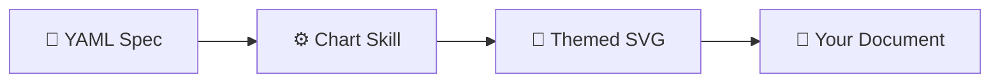

## 📋 Prerequisites

- **Node.js 18+** — check with `node --version`
- **npm** — comes with Node.js

That's it. No native compilers, system libraries, or other tools needed.

## 🚀 Quick Start

### 1. Install the skill

```bash
npx skills add onsen-ai/chart-skill
```

### 2. Install dependencies

```bash
cd <skill-directory> && npm install --production
```

Installs vega, vega-lite, and js-yaml (~50MB, one-time only).

### 3. (Optional) Configure defaults

```bash
node scripts/setup.mjs
```

Pick your default theme, output directory, and variant. **This is optional** — the skill works immediately with sensible defaults (onsen theme, desktop size, light variant).

### 4. Render

```bash
# From a file
node scripts/render.mjs --spec chart.yaml --output chart.svg

# Inline YAML
node scripts/render.mjs --yaml 'mark: bar
data:
  values:
    - x: A
      y: 28
    - x: B
      y: 55
encoding:
  x: { field: x, type: nominal }
  y: { field: y, type: quantitative }' --output chart.svg
```

That's it. 🎉

---

## 📈 Chart Gallery

All charts below were generated by this skill from the YAML specs in [`examples/`](examples/).

### Bar Chart (Vertical)

<table>
<tr><td><strong>🔵 Onsen Light</strong></td><td><strong>🌙 Onsen Dark</strong></td></tr>
<tr>
<td>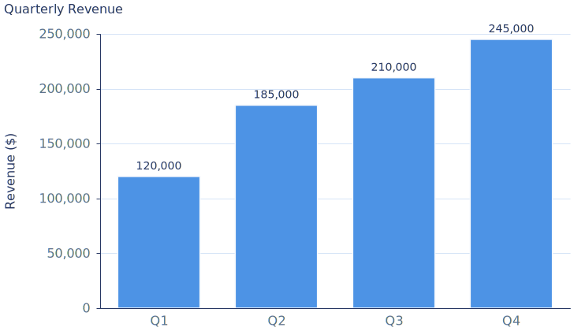</td>
<td>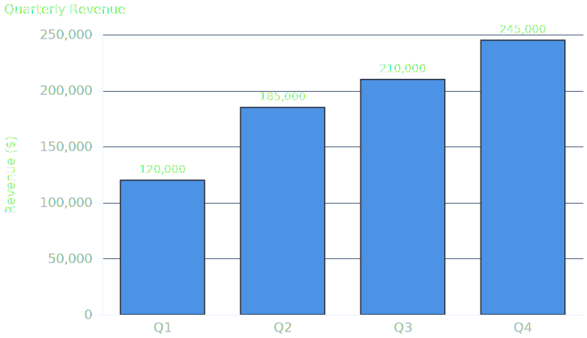</td>
</tr>
</table>

<details>
<summary>📝 YAML spec</summary>

```yaml
title: Quarterly Revenue
mark: bar
data:
  values:
    - quarter: Q1
      revenue: 120000
    - quarter: Q2
      revenue: 185000
    - quarter: Q3
      revenue: 210000
    - quarter: Q4
      revenue: 245000
encoding:
  x: { field: quarter, type: nominal, title: null }
  y: { field: revenue, type: quantitative, title: "Revenue ($)" }
```

</details>

### Bar Chart (Horizontal)

<table>
<tr><td><strong>🔵 Onsen Light</strong></td><td><strong>🌙 Onsen Dark</strong></td></tr>
<tr>
<td>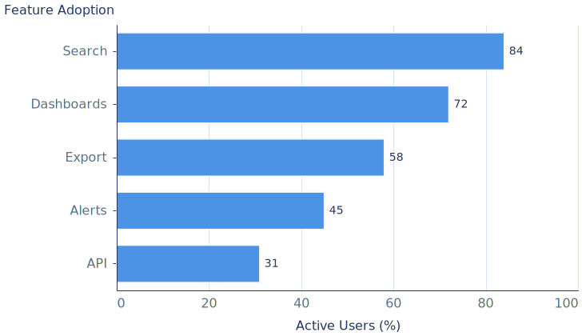</td>
<td>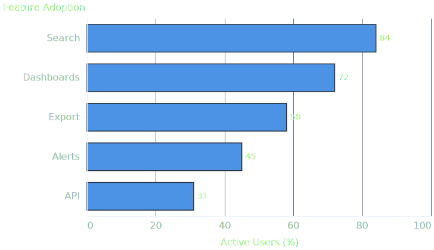</td>
</tr>
</table>

<details>
<summary>📝 YAML spec</summary>

```yaml
title: Feature Adoption
mark: bar
data:
  values:
    - feature: Search
      users: 84
    - feature: Dashboards
      users: 72
    - feature: Export
      users: 58
    - feature: Alerts
      users: 45
    - feature: API
      users: 31
encoding:
  y: { field: feature, type: nominal, title: null, sort: "-x" }
  x: { field: users, type: quantitative, title: "Active Users (%)" }
```

</details>

### Stacked Bar Chart

<table>
<tr><td><strong>🔵 Onsen Light</strong></td><td><strong>🌙 Onsen Dark</strong></td></tr>
<tr>
<td>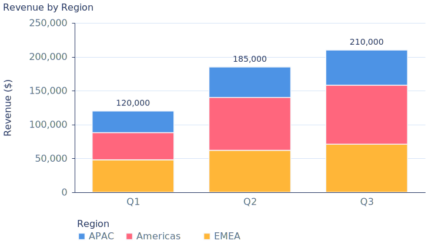</td>
<td>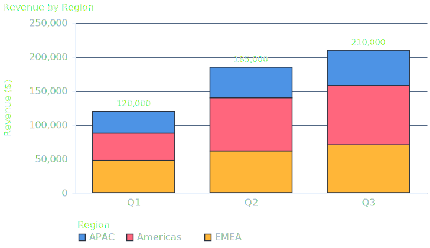</td>
</tr>
</table>

<details>
<summary>📝 YAML spec</summary>

```yaml
title: Revenue by Region
mark: bar
data:
  values:
    - quarter: Q1
      region: EMEA
      revenue: 48000
    # ... (add color encoding for stacking)
encoding:
  x: { field: quarter, type: ordinal, title: null }
  y: { field: revenue, type: quantitative, title: "Revenue ($)" }
  color: { field: region, type: nominal, title: Region }
```

</details>

### Line Chart

<table>
<tr><td><strong>🔵 Onsen Light</strong></td><td><strong>🌙 Onsen Dark</strong></td></tr>
<tr>
<td>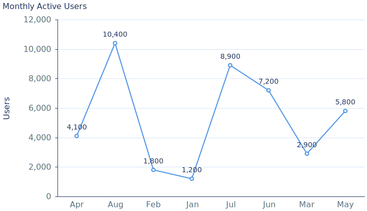</td>
<td>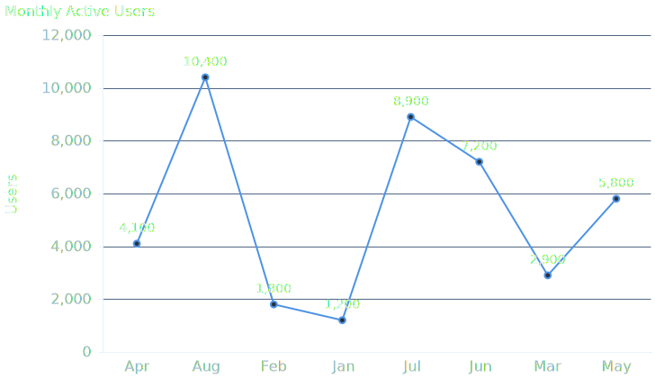</td>
</tr>
</table>

<details>
<summary>📝 YAML spec</summary>

```yaml
title: Monthly Active Users
mark: line
data:
  values:
    - month: Jan
      users: 1200
    - month: Feb
      users: 1800
    # ...
encoding:
  x: { field: month, type: ordinal, title: null }
  y: { field: users, type: quantitative, title: Users }
```

</details>

### Multi-Series Line Chart

<table>
<tr><td><strong>🔵 Onsen Light</strong></td><td><strong>🌙 Onsen Dark</strong></td></tr>
<tr>
<td>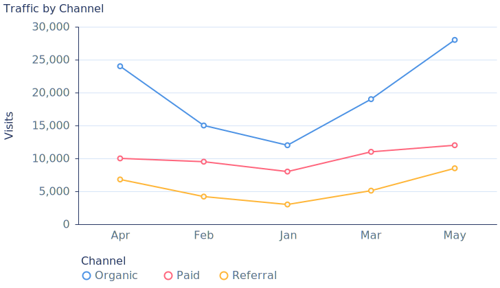</td>
<td>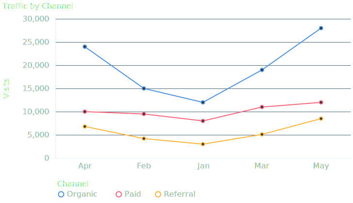</td>
</tr>
</table>

<details>
<summary>📝 YAML spec</summary>

```yaml
title: Traffic by Channel
mark: line
data:
  values:
    - month: Jan
      channel: Organic
      visits: 12000
    # ...
encoding:
  x: { field: month, type: ordinal, title: null }
  y: { field: visits, type: quantitative, title: Visits }
  color: { field: channel, type: nominal, title: Channel }
```

</details>

### Area Chart

<table>
<tr><td><strong>🔵 Onsen Light</strong></td><td><strong>🌙 Onsen Dark</strong></td></tr>
<tr>
<td>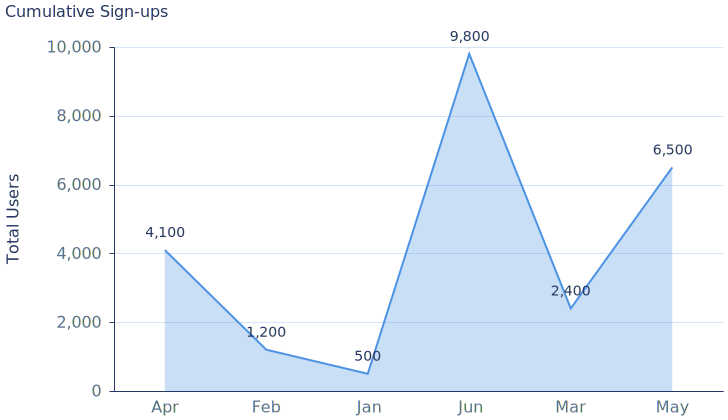</td>
<td>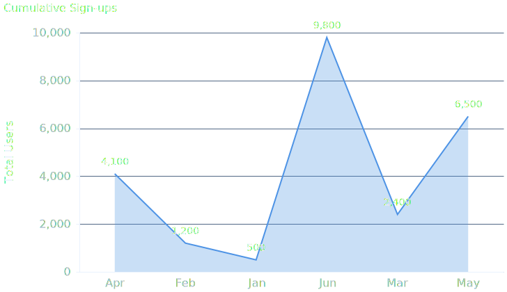</td>
</tr>
</table>

<details>
<summary>📝 YAML spec</summary>

```yaml
title: Cumulative Sign-ups
mark: area
data:
  values:
    - month: Jan
      total: 500
    - month: Feb
      total: 1200
    # ...
encoding:
  x: { field: month, type: ordinal, title: null }
  y: { field: total, type: quantitative, title: Total Users }
```

</details>

### Scatter Plot

<table>
<tr><td><strong>🔵 Onsen Light</strong></td><td><strong>🌙 Onsen Dark</strong></td></tr>
<tr>
<td>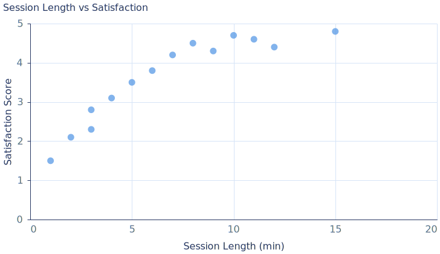</td>
<td>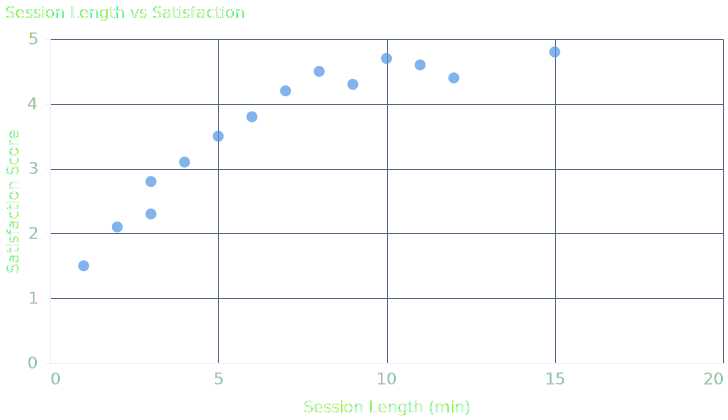</td>
</tr>
</table>

<details>
<summary>📝 YAML spec</summary>

```yaml
title: Session Length vs Satisfaction
mark: point
data:
  values:
    - duration: 2
      score: 2.1
    - duration: 5
      score: 3.5
    # ...
encoding:
  x: { field: duration, type: quantitative, title: "Session Length (min)" }
  y: { field: score, type: quantitative, title: "Satisfaction Score" }
```

</details>

---

## 🎨 Theme Gallery

9 built-in themes — the same 6-segment stacked bar chart rendered in each, showing the full colour palette:

### Light Mode

<table>
<tr>
<td align="center"><strong>🔵 Onsen</strong><br>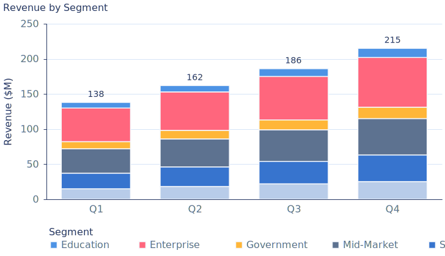</td>
<td align="center"><strong>⚪ Neutral</strong><br>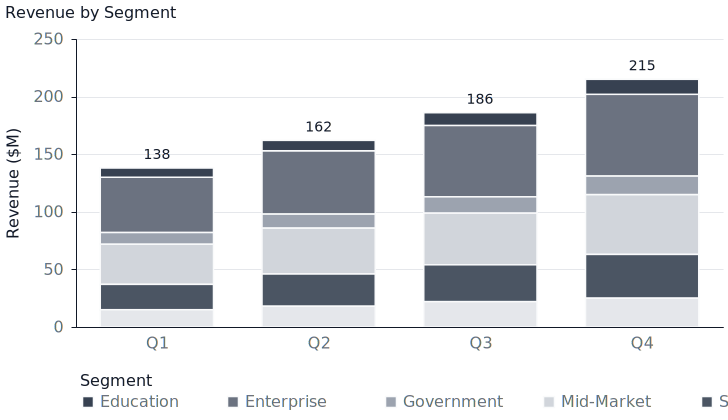</td>
<td align="center"><strong>🔴 Bain</strong><br>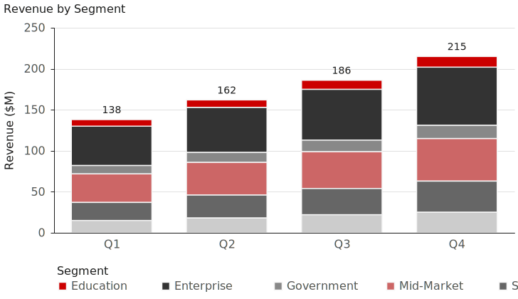</td>
</tr>
<tr>
<td align="center"><strong>🔷 McKinsey</strong><br>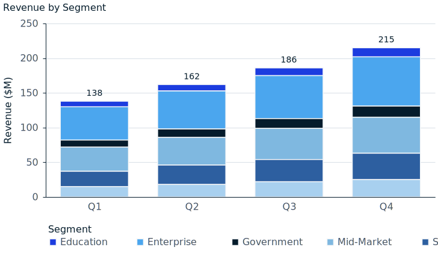</td>
<td align="center"><strong>🟢 BCG</strong><br>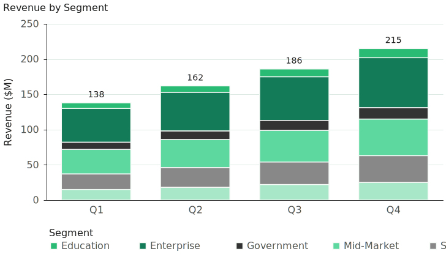</td>
<td align="center"><strong>🌿 Holland & Barrett</strong><br>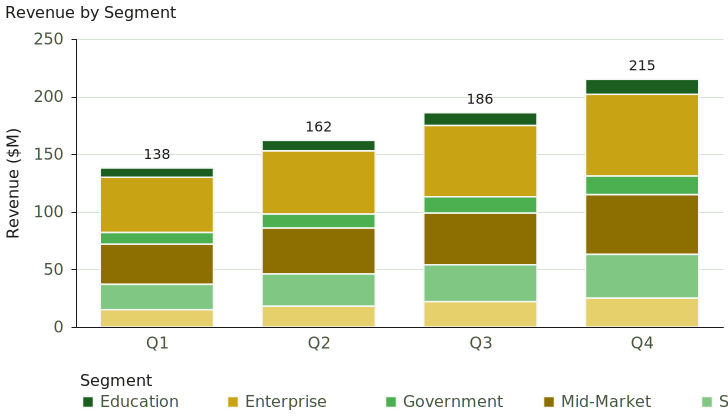</td>
</tr>
<tr>
<td align="center"><strong>📰 Economist</strong><br>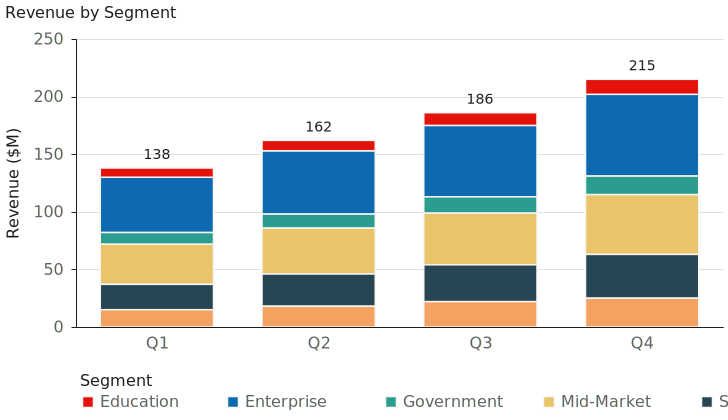</td>
<td align="center"><strong>📄 FT</strong><br>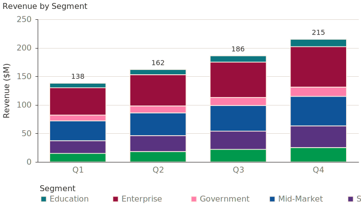</td>
<td align="center"><strong>🟩 Deloitte</strong><br>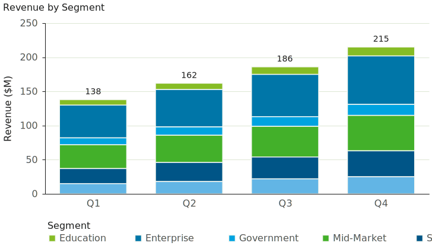</td>
</tr>
</table>

### Dark Mode

<table>
<tr>
<td align="center"><strong>🔵 Onsen</strong><br>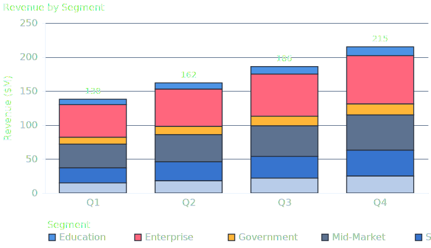</td>
<td align="center"><strong>⚪ Neutral</strong><br>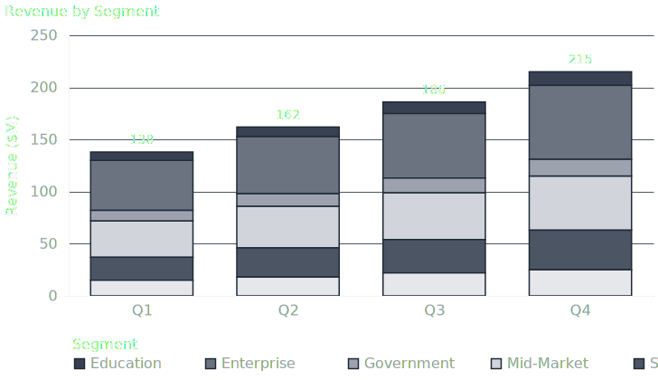</td>
<td align="center"><strong>🔴 Bain</strong><br>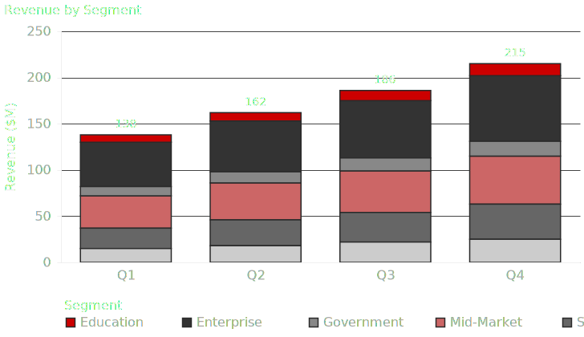</td>
</tr>
<tr>
<td align="center"><strong>🔷 McKinsey</strong><br>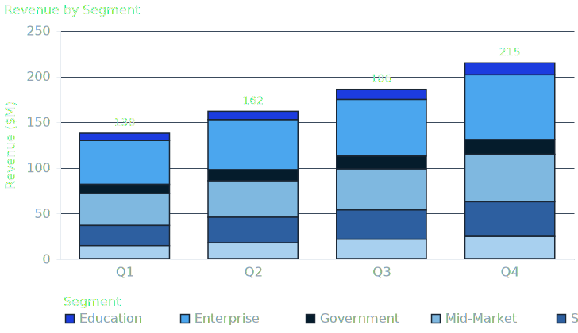</td>
<td align="center"><strong>🟢 BCG</strong><br>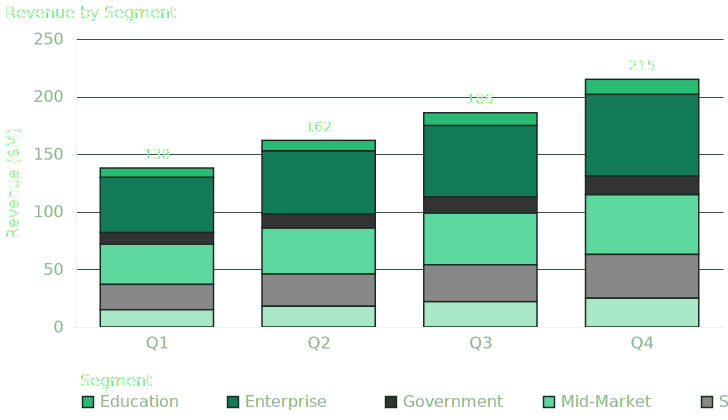</td>
<td align="center"><strong>🌿 Holland & Barrett</strong><br>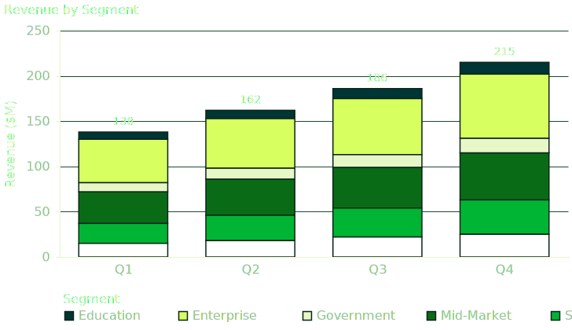</td>
</tr>
<tr>
<td align="center"><strong>📰 Economist</strong><br>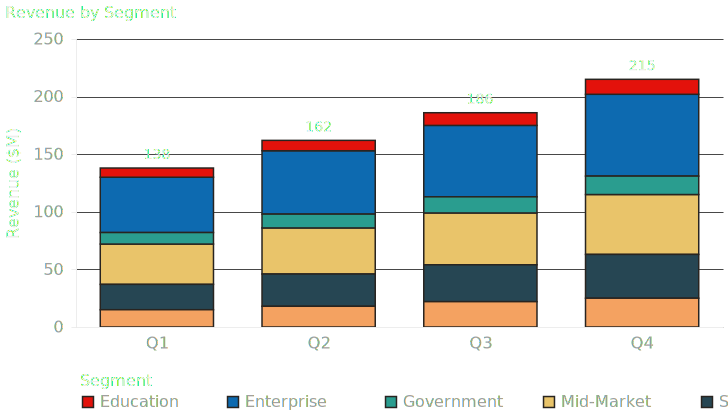</td>
<td align="center"><strong>📄 FT</strong><br>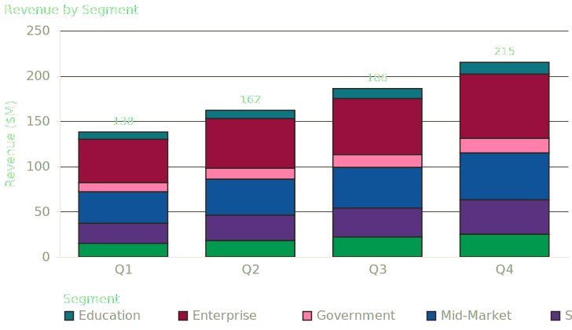</td>
<td align="center"><strong>🟩 Deloitte</strong><br>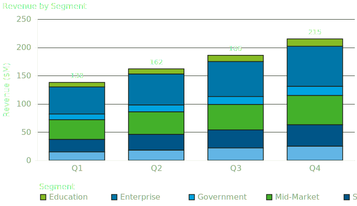</td>
</tr>
</table>

### Theme Reference

| Theme | Flag | Primary | Style | Best for |
|-------|------|---------|-------|----------|
| Onsen | `--theme onsen` | 🔵 `#4d93e5` | Warm, friendly blue | Product dashboards, blog posts |
| Neutral | `--theme neutral` | ⚪ `#374151` | Clean grayscale | Academic papers, formal reports |
| Bain | `--theme bain` | 🔴 `#CC0000` | Bold red + greys | Strategy consulting decks |
| McKinsey | `--theme mckinsey` | 🔷 `#1c3cdf` | Deep blue | Executive presentations |
| BCG | `--theme bcg` | 🟢 `#29BA74` | Fresh green | Sustainability, growth reports |
| Holland & Barrett | `--theme holland-barrett` | 🌿 `#005335` | H&B deep green + lime | Health, wellness, retail |
| Economist | `--theme economist` | 📰 `#E3120B` | Red + teal | Data journalism, editorials |
| FT | `--theme ft` | 📄 `#0D7680` | Teal on salmon | Financial reporting |
| Deloitte | `--theme deloitte` | 🟩 `#86BC25` | Lime green + blue | Audit, advisory decks |

**Custom themes?** Drop a JSON file in `~/.chart-skill/themes/` — see [`themes/onsen.json`](themes/onsen.json) for the format.

---

## 📱 Responsive Sizing

The same chart at desktop vs mobile sizes:

<table>
<tr><td><strong>🖥️ Desktop (728px)</strong></td><td><strong>📱 Mobile (600px)</strong></td></tr>
<tr>
<td></td>
<td>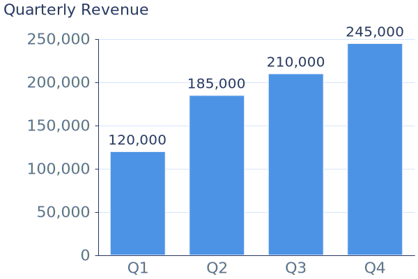</td>
</tr>
</table>

Mobile variants automatically:
- Use larger font sizes (22px vs 16px) to stay readable when scaled
- Hide Y-axis titles to save space
- Skip overlapping X-axis labels

---

## 🎯 Design System

The chart styling is opinionated — every default was chosen deliberately to produce clean, readable charts without manual tweaking. Here's what we do and why.

### Typography

| Element | Size (desktop) | Size (mobile) | Weight | Color |
|---------|---------------|--------------|--------|-------|
| Chart title | 16px | 22px | 500 (medium) | `text` |
| Axis labels | 16px | 22px | normal | `textLight` |
| Axis titles | 16px | 22px | 500 (medium) | `text` |
| Value labels | 14px | 20px | 500 (medium) | `text` |

All font sizes match the surrounding article body text on desktop. Mobile sizes are ~38% larger to compensate for SVG downscaling on smaller screens.

### Axes

| Element | Style | Why |
|---------|-------|-----|
| **Y-axis ticks** | Max 5, `scale.nice` aligned | Top tick always sits at the axis end |
| **X-axis ticks** | Hidden | Cleaner look — labels are sufficient |
| **X-axis label padding** | 8px from axis, 12px to title | Breathing room without wasted space |
| **Gridlines** | Solid, `divider` color | Subtle but present — dashed lines feel busy |
| **Domain lines** | `text` color, rendered on top of marks | Strong contrast, visible even behind tall bars |
| **Label overlap** | `parity` strategy | Skips every other label on mobile when they'd collide |
| **Chart title** | Top-left, 10px offset | Left-aligned for natural reading flow |

### Marks

| Mark | Style | Why |
|------|-------|-----|
| **Bar** | Square corners, 1.5px background-colored stroke | Flat, modern look. The stroke creates subtle visual separation between segments without harsh borders |
| **Line** | 2px stroke with hollow dots (white fill, colored 2px border) | Dots mark individual data points without dominating the line. Hollow style avoids visual heaviness |
| **Area** | 30% opacity fill with solid border line | Fill shows volume, border line shows the trend clearly |
| **Point** (scatter) | Solid filled circles, 120 size | Larger dots for better visibility; solid fill since there's no line to compete with |

### Color Hierarchy

| Token | Role | Contrast |
|-------|------|----------|
| `text` | Titles, axis domain lines | Highest — near black/white |
| `textLight` | Labels, legend text | Secondary — readable but recedes |
| `divider` | Gridlines | Subtle — visible but doesn't compete |
| `bgGray` | Bar stroke, line dot fill | Matches container background |
| `primaryColor` | All marks (bars, lines, dots) | Brand accent color |

The `bgGray` token matches the chart container background, creating a "cut-out" effect for bar segment borders and line chart dot fills rather than a visible contrasting border.

### Value Labels

| Chart type | Labels | Position | Format |
|------------|--------|----------|--------|
| **Single-series bar** | Each bar's value | Above (vertical) or right (horizontal), 6px gap | Comma-separated (`12,400`) |
| **Single-series line/area** | Each data point | Above, 10px gap | Comma-separated |
| **Stacked bar** | Aggregate total only | Above the full stack | Comma-separated |
| **Multi-series line** | None | — | Too cluttered with overlapping lines |
| **Scatter** | None | — | Dots are the data |

### Legend

- **Position**: bottom, horizontal — doesn't eat into the chart width
- **Symbols**: 120px size for visibility
- **Direction**: horizontal row layout
- **Background**: transparent (no box)

### Responsive Strategy

| Aspect | Desktop (728px) | Mobile (600px) |
|--------|----------------|----------------|
| Font sizes | 16px | 22px (~38% larger) |
| Y-axis title | Shown | Hidden (saves ~40px width) |
| Value labels | Shown | Shown |
| Label overlap | All shown | Parity (skip alternating) |
| SVG scaling | ~1:1 on 728px container | ~53% on 320px screen |
| Effective text | ~16px | ~12px (22 × 0.53) |

The mobile SVG is intentionally rendered wider than the screen, with proportionally larger text. When the browser scales it down to fit, the text ends up roughly the same apparent size as desktop.

### SVG Post-processing

One non-obvious detail: Vega renders axis domain lines *behind* bar marks in the SVG. For stacked or tall bars, this means the axis disappears behind the bars. The renderer post-processes the SVG to duplicate axis domain lines and insert them *after* the mark groups, so they always paint on top.

---

## 🔧 CLI Reference

```
node render.mjs [options]

Input (one required):
  --spec PATH       YAML spec file
  --yaml STRING     Inline YAML spec

Output:
  --output PATH     Output file path
  --output-dir DIR  Output directory
  --all-variants    Render all 4 combos (light/dark × desktop/mobile)
  --quiet           Print only output paths to stdout

Styling:
  --theme NAME      onsen, neutral, or custom theme name
  --variant NAME    light or dark
  --size NAME       desktop (728px) or mobile (600px)
  --width N         Override width in pixels
  --height N        Override height in pixels

Info:
  --list-themes     Show available themes
  --help            Show help
```

---

## 🤖 Agent Integration

The render script prints the output file path to **stdout** — perfect for agent workflows:

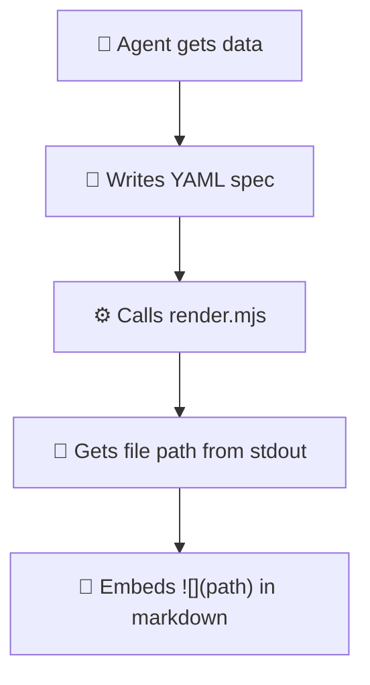

---

## 🎁 What you get for free

No config needed — these are applied automatically:

- ✅ **Value labels** on bars and data points (comma-formatted)
- ✅ **Stacked bar totals** above each stack
- ✅ **Light/dark mode** variants
- ✅ **Desktop/mobile** responsive sizes
- ✅ **Axis formatting** — 5 ticks, horizontal labels, clean gridlines
- ✅ **Legend** — horizontal, bottom-positioned for multi-series
- ✅ **Number formatting** — thousands separators

---

## 📁 Project Structure

```
chart-skill/
├── SKILL.md              # 🤖 Skill definition (for AI agents)
├── themes/
│   ├── onsen.json        # 🔵 Default theme
│   └── neutral.json      # ⚪ Academic theme
├── examples/
│   ├── *.yaml            # 📝 Example specs
│   └── output/           # 🖼️ Generated SVGs
└── scripts/
    ├── render.mjs        # ⚙️ CLI entry point
    ├── setup.mjs         # 🔧 Interactive setup wizard
    └── lib/
        ├── config.mjs    # Config management
        ├── themes.mjs    # Theme loading
        ├── defaults.mjs  # Vega-Lite defaults
        └── renderer.mjs  # SVG rendering engine
```

## 📄 License

MIT
