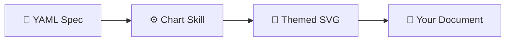
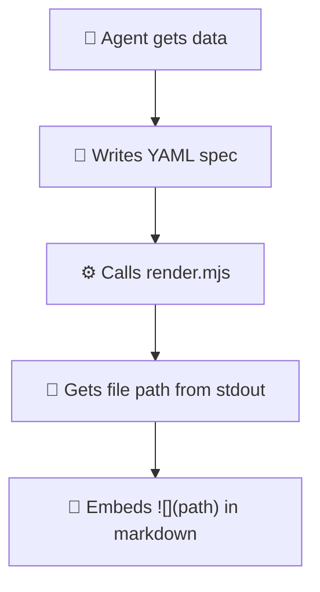

# 📊 Chart Skill

> Turn YAML into beautiful, publication-grade chart images. No design skills required.

A [Claude Code](https://claude.com/claude-code) skill that generates SVG charts from simple YAML specs using Vega-Lite under the hood. Write data, get charts.

## ✨ What it does



You write this:

```yaml
title: Quarterly Revenue
mark: bar
data:
  values:
    - quarter: Q1
      revenue: 120000
    - quarter: Q2
      revenue: 185000
    - quarter: Q3
      revenue: 245000
encoding:
  x: { field: quarter, type: nominal, title: null }
  y: { field: revenue, type: quantitative, title: "Revenue ($)" }
```

You get this: a publication-ready SVG with themed colors, value labels, proper axes, and formatted numbers. Drop it straight into your markdown, report, or presentation.

## 🚀 Quick Start

### 1. Install

```bash
npx skills add onsen-ai/chart-skill
```

### 2. Setup

```bash
node scripts/setup.mjs
```

This installs dependencies (~50MB for Vega) and lets you pick your default theme.

### 3. Render

```bash
node scripts/render.mjs --spec my-chart.yaml --output chart.svg
```

That's it. 🎉

## 🎨 Themes

| Theme | Vibe | Preview |
|-------|------|---------|
| `onsen` | 🔵 Blue primary, warm & friendly | Product dashboards, blog posts |
| `neutral` | ⚪ Grayscale, clean & formal | Academic papers, business reports |

**Custom themes?** Drop a JSON file in `~/.chart-skill/themes/` and use `--theme your-name`.

## 📈 Supported Chart Types

| Type | Mark | Best for |
|------|------|----------|
| Bar (vertical) | `bar` | Category comparisons |
| Bar (horizontal) | `bar` | Rankings, long labels |
| Stacked bar | `bar` + `color` | Composition over time |
| Line | `line` | Trends, time series |
| Multi-line | `line` + `color` | Comparing trends |
| Area | `area` | Cumulative totals |
| Scatter | `point` | Correlations |

## 🔧 CLI Flags

```
node render.mjs --spec <file> [options]

--spec PATH       YAML spec file (required)
--theme NAME      Theme: onsen, neutral, or custom
--variant NAME    light or dark
--size NAME       desktop (728px) or mobile (600px)
--output PATH     Output file path
--output-dir DIR  Output directory
--width N         Override width
--height N        Override height
--all-variants    Render all 4 combos (light/dark × desktop/mobile)
--list-themes     Show available themes
--quiet           Print only output paths
```

## 🤖 Agent Integration

The render script prints the output file path to **stdout** — perfect for agent workflows:



```bash
# Agent writes spec, renders, embeds
echo ")" >> report.md
```

## 🎁 What you get for free

No config needed — these are applied automatically:

- ✅ **Value labels** on bars and data points (comma-formatted)
- ✅ **Stacked bar totals** above each stack
- ✅ **Light/dark mode** variants
- ✅ **Desktop/mobile** responsive sizes
- ✅ **Axis formatting** — 5 ticks, horizontal labels, clean gridlines
- ✅ **Legend** — horizontal, bottom-positioned for multi-series
- ✅ **Number formatting** — thousands separators

## 📁 Project Structure

```
chart-skill/
├── SKILL.md              # Skill definition (for AI agents)
├── themes/
│   ├── onsen.json        # 🔵 Default theme
│   └── neutral.json      # ⚪ Academic theme
└── scripts/
    ├── render.mjs        # CLI entry point
    ├── setup.mjs         # Interactive setup wizard
    └── lib/
        ├── config.mjs    # Config management
        ├── themes.mjs    # Theme loading
        ├── defaults.mjs  # Vega-Lite defaults
        └── renderer.mjs  # SVG rendering engine
```

## 📄 License

MIT
